"# lesson3" 
# JAVA SCRIPT STRING METHODS

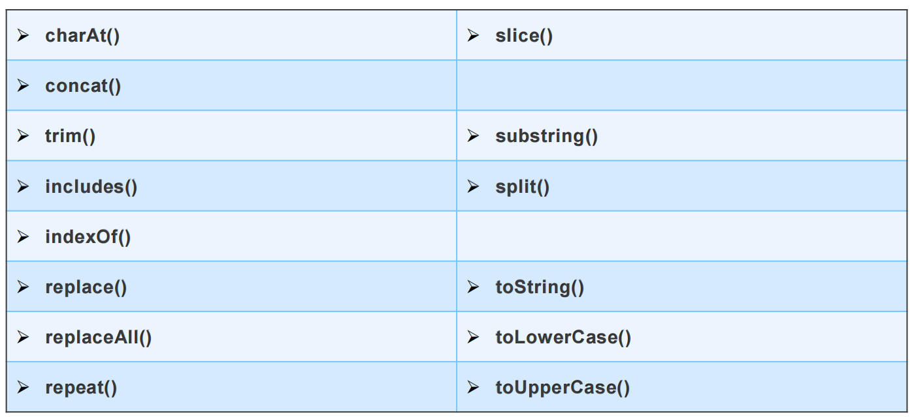

# JavaScript String method charAt()
-  The charAt() method returns the character at a specified index (position) in a string.
The index of the first character is 0, the second 1, ...
The index of the last character is string length - 1 .

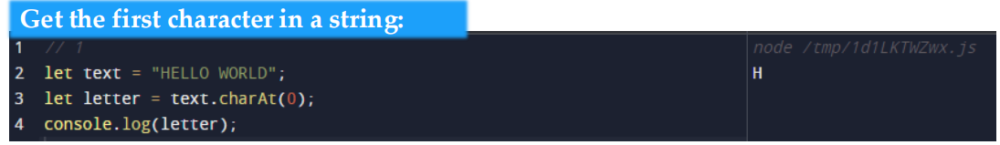

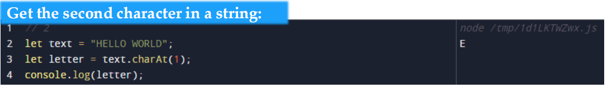

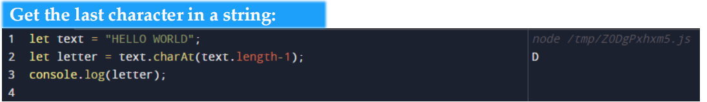

# JavaScript String method at()
- The at() method takes an integer value and returns a new String.
This method allows for positive and negative integers. Negative integers count 
back from the last string character.

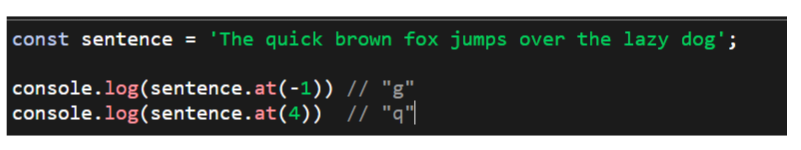
 
# JavaScript String method concat()

- The concat() method joins two or more strings.
The concat() method does not change the existing strings.
The concat() method returns a new string

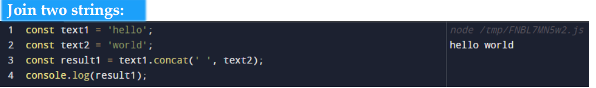

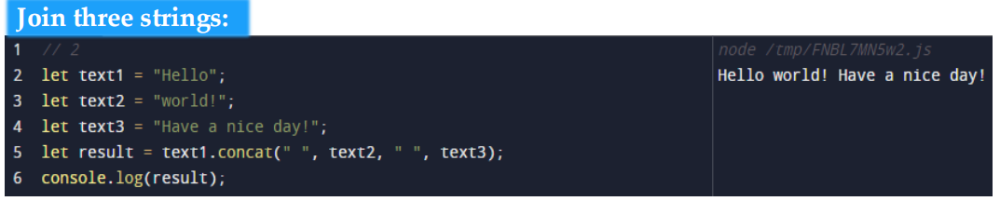

# JavaScript String method replace()

 - The replace() method searches a string for a value or a regular expression.
The replace() method returns a new string with the value(s) replaced.
The replace() method does not change the original string.

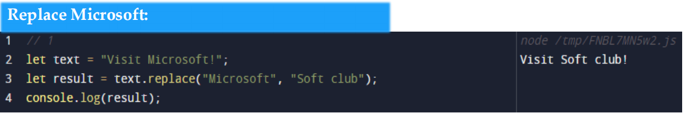
# JavaScript String method replaceAll()
 
 The replaceAll() method returns a new string with all matches of a pattern replaced by
a replacement.

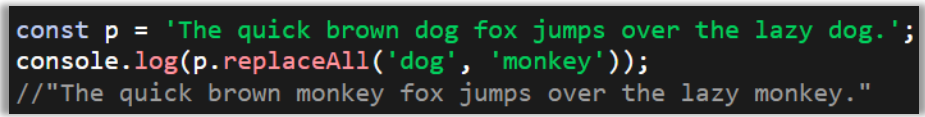
# JavaScript String method split()

The split() method splits a string into an array of substrings. The split() method returns the new
array. The split() method does not change the original string. If (" ") is used as separator, the string
is split between words.

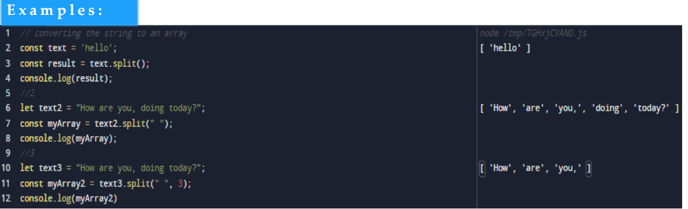

# JavaScript String method substring(start,end)
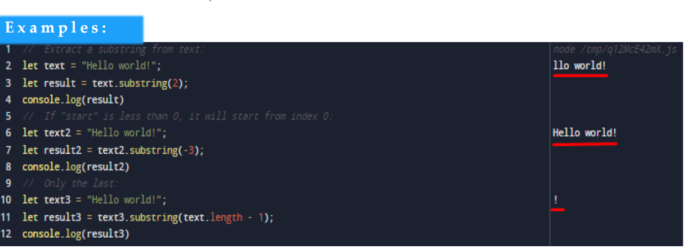

The toLowerCase() method converts a string to lowercase letters.
The toLowerCase() method does not change the original string.

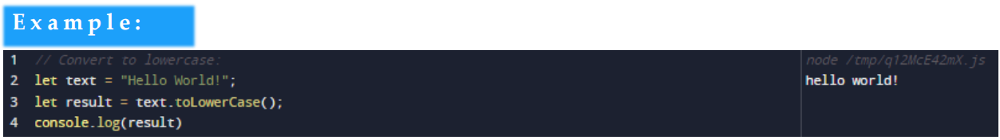

JavaScript String method toUpperCase()

The toUpperCase() method converts a string to uppercase letters, using current locale.
The toUpperCase() method does not change the original string.

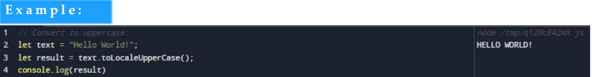
# JavaScript String method trim()

# JavaScript String method includes()
The includes() method returns true if a string contains a specified string.
Otherwise it returns false.
The includes() method is case sensitive.

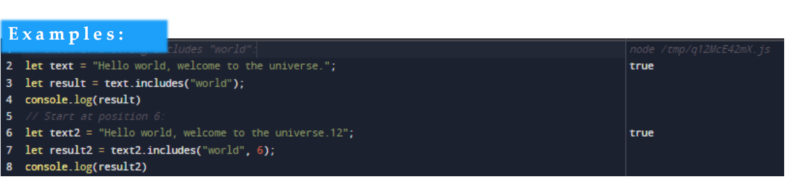